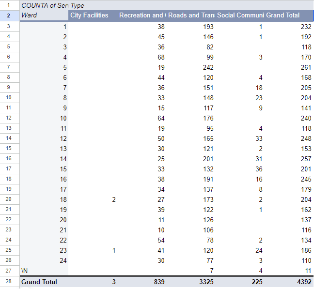

**November 5th, 2024**<br>
**MPAD2003 Introductory Data Storytelling**<br>
**Kiran Butter**<br>
**Presented to Jean-Sébastien Marier**<br>

# Midterm Project: Exploratory Data Analysis (EDA)


## 1. Introduction

This assignment aims to extract, clean and analyze a provided dataset, create a graph and find a potential story from the findings. The dataset is a subset of a City of Ottawa larger dataset, called ‘2024 Service Requests”, found on the City of Ottawa’s open data portal, last updated on October 3rd, 2024 and then featured 251,714 entries of service requests from various means: contact or client service centres, email and web-based service portals. According to the City of Ottawa (2024b), “the data provides a summary of requests for service that require action by City staff. Data is presented by the ward and shows the responsible City department and service description.” The service requests data containing the request type, description, status, address, longitude, latitude and ward. This analysis is conducted in four sections: getting data, understanding data (VIMO analysis, cleaning data, exploratory data analysis), potential story and conclusion.


[Link to the original dataset on Open Ottawa](https://open.ottawa.ca/documents/65fe42e2502d442b8a774fd3d954cac5/about).

[Link to the CSV version](https://raw.githubusercontent.com/jsmarier/course-datasets/refs/heads/main/ottawa-311-service-requests-august-2024.csv).


## 2. Getting Data

**Instructions to import the data into Google Sheets**: 

1. Right-click the link, click **“Save link as…”** and save the CSV file to your computer. It will save as a text file. 
2. Open Google Sheets, **File > Import**, then upload the dataset text file. 
3. Once uploaded, select the **comma** for the **separator type**, and click **Import data**. 
4. Once imported, the message, **"Success! File imported. Open now >>"** will appear. Click on the **“Open now >>”** blue hyperlink, and it will take you to the imported dataset. 

**Screen capture of the dataset right after it has been imported:** 

.png>)<br>
*Figure 1: This screen capture shows the dataset after it has been imported*.


[Link to the Google Sheet data spreadsheet](https://docs.google.com/spreadsheets/d/1eOZ1uVapeKvocDCgMW5fZFrOu2O9v17iskftLEeP6RE/edit?usp=sharing).


There are 11 columns, letters A to K, and 28539 rows of data. In terms of how the data is structured, every data is within their respective cells– but some data is hidden at first glance. It is revealed upon clicking on it by expanding it. Since it is a dataset from the City of Ottawa, the description is written in English and French, dragging the cell's length–impacting readability. What also impacts readability is the value of ‘\N’ in the cells of the address, latitude, longitude and sometimes ward columns, indicating restricted, hidden or missing data. We cannot fully assess the data given if values are unavailable, so we are limited to what we can read and take away. 

One question I thought of when examining the raw data is **“Which ward has the most requests per type?”** since it is important to see what wards need service done to improve. Thus, columns A, C and J (the service request IDs, the type and ward number) are especially relevant in this analysis. Columns A and C contain nominal variables since they consist of categories and differ in names with no natural order (Touhidul Islam, 2024); the type and service request IDs are distinguished. As for column J, it consists of numeric variables since they are numbers and are discrete by being a specific value (ward number) (Islam, 2024).
These three columns are analyzed further, along with the rest of the dataset. 


## 3. Understanding Data

### 3.1. VIMO Analysis

The **VIMO** analysis is a method used to ensure the quality, accuracy and correctness of a given dataset. For a dataset to be accurate, the data values must be valid (not blank or missing and within a valid range) and correct (Statistics Canada, 2020, 1:43). **VIMO** is an acronym that stands for **valid**, **invalid**, **missing** and **outlier values**, which is how the dataset will be assessed.

For this analysis, columns A, C and J will be assessed since they are key to ‘’answer‘’ to our question. 

**VALID VALUES**

The first step in the **VIMO** analysis is to assess the **validity**, ensuring values are correct and accurate. 
Columns A and C contain valid values since there are no duplicate service request IDs, and the types are within the scope of options. As for column J, it is challenging to see what data is accurate and correct given some cell information is hidden by the value ‘\N’. It may appear like an error, but I assume it was intentional. According to the City of Ottawa (2024b), the address, latitude and longitude columns only display information for public service requests to avoid publishing personal information. However, it does not mention so for the ward column; therefore, we will assume that ‘\N’ means non-applicable instead of private information. 

**INVALID** and **MISSING VALUES**

**Invalid** values are impossible and cannot register as valid in the given context (Statistics Canada, 2020, 1:52). We already determined that columns A and C are valid– but column J’s non-applicable problem still stands. Since we cannot render these ‘\N’ values invalid because of their unknown content, it is better to assess them as **missing**, where a variable is left blank, and we must evaluate the remaining data (Statistics Canada, 2020, 2:06). 

**OUTLIER VALUES**

**Outlier** values are extremely small or large to relative expectations (Statistics Canada, 2020, 2:17). I would argue there are no outlier values. While the service request IDs are lengthy, it is a typical size for IDs. Column C has values that reflect the same types and no other value outside the assigned options. Column J (besides the ones that contain ‘\N’) are all within 1 - 24, the number of wards in the Ottawa region (City of Ottawa, n.d.-b).


### 3.2. Cleaning Data


**ADDING FILTERS** 

Since there are a lot of cases of non-applicable/hidden information, to clear the dataset, I only focused on requests that have public information easily available to us. 
I cleared every instance of \N in the address column (and thus, the longitude, latitude and ward column) using the **“Create a filter”** option in Google Sheets. 

**Instructions** (Marier, 2021, 6:03): 

1. Click **Data** >  **Create a filter**. 
2. Click the **filter button (represented by three horizontal lines)** next to the address column.
3. Click on **Filter by condition**, select **‘Text does not contain’**, and input **‘\N’** 
4. Click **OK** at the bottom. 
5. **Copy and paste** the entire dataset by clicking the gray box in the far left corner above the row numbers to apply the changes.

This makes it easier to create charts of public requests since we do not have to incorporate 28935 rows of data. Instead, we can focus on data that is available to us (the public requests).


**`SPLIT` FUNCTION**

Since the dataset is from the City of Ottawa, it included both English and French, but considering that English is more widely known, I removed the French in the dataset to be more clear. 
The French is in the description column. To remove the French, I used the **`SPLIT`** function; a function used to split text based on a separator into its own parts.


**Instructions** (Marier, 2021, 13:00;  Google, n.d.):

1. Right-click column D > **Insert 1 column right**. You will need to do this twice. 
2. In E2, initialize the **`ARRAYFORMULA`** function by typing **`=ARRAYFORMULA`** (we will use **`ARRAYFORMULA`** to fill up the entire column, instead of using the fill handle).
3. Type in the brackets: 
```r
SPLIT(D2:D4393, “|”)
```
where the range is D2:D4393 and delimiter is “|”

*Note: it is only 4393 rows instead of 28935 since we filtered the data.*

4. Hit **Enter** on your keyboard.
5. **Copy and Paste** the entire English column (column E).
6. Right-click and go to **Paste Special** > **Values only** (allows us to remove the French description (column F) and mixed English and French description columns (column D)). 


**FREEZING COLUMNS**

Freezing columns and rows is useful for scrolling through the dataset and keeping track of the column or row you are in. This is useful, considering the dataset is large. 

**Instructions** (Marier, 2021, 5:42):

1. Click the number of where the column labels are (usually row one, thus the number one on the far right).
2. Click **View** > **Freeze** > **Up to 1 row**.

What this did was freeze that specific row, so while we scroll, the column label will follow along.


**Screen capture of the dataset after cleanup:**

<br>
*Figure 2: This screen capture shows the dataset after it has been cleaned.*


### 3.3. Exploratory Data Analysis (EDA)

My goal was to originally show how many requests wards receive per request type, but since the dataset has been cleaned and modified to remove non-applicable information, the goal is now: **“Which ward has the most requests per the four public types: roads and transportation, city facilities, recreation and culture and social community service?”**

I chose a stacked column chart since it best illustrates how each request type contributes to the overall total per ward. Furthermore, according to Statistics Canada (2021), stacked bar charts are difficult to analyze if there are too many categories in each stack,” so limiting the chart to four options made it easier to analyze the four request types. Additionally, using one graph rather than four separate to present the data is supported by Cleveland and McGill’s hierarchy and elementary perceptual tasks, allowing the viewer to digest and compare the values with ease (Cairo, 2016, ch. 5).

The potential story is that some wards are well, while others need improvement in the four request types. Immediately, the amount of requests for roads and transportation is noticeable, with all wards experiencing issues. Another noticeable variable is the lack of city facilities requests, with only wards 18 and 23 experiencing requests. As for social community service, some wards vary from a lot to little to none, and all wards received a handful of recreation and culture requests. Overall, the story is to highlight the work needed in these wards.


**Screen capture of the pivot table:**

<br>
*Figure 3: This screen capture shows the pivot table, with values ward (rows), type (columns) and service request ID (values)*.


**Screen capture of the exploratory chart:**


*Figure 4: This screen capture shows the graph made from the pivot table. It shows the number of requests per four public request types*.

## 4. Potential Story

Gathering more data or variables, such as the status (resolved, cancelled, active) reflected in the original dataset can be useful for telling the story of which wards need improvements and where they perform well. While we do see how many requests are made, we cannot see if the request was resolved, cancelled or is active, so we cannot know if areas are being improved if requests were cancelled or if they are currently being worked on. To gather insight, we could interview the councillors respective to their ward to see how requests get handled accordingly. For example, we saw that only wards 18 and 23 have city facilities requests from our graph, so we can interview councillors Marty Carr and Allan Hubley to see why there are instances of such (City of Ottawa, n.d.-a).

Furthermore, digging deeper into Ottawa’s funds can determine why some requests are not fulfilled. On August 8th, 2024, which is recent to the date of service requests in the dataset (August 1st), there was a statement from Mayor Mark Sutcliffe that Ottawa was facing a financial crisis. Sutcliffe claims “Our city is facing unprecedented financial challenges that are not of our making” and that “this can’t continue or we will face historic challenges in our next budget” (City of Ottawa, 2024a). This statement highlights that there’s a possibility that some areas cannot be improved at the moment since there is a lack of budget or income, which will add to the story.


## 5. Conclusion

My thought process throughout this assignment was to clean the data to create a graph easily. The most challenging part would be cleaning the data. It was difficult to find what could be edited considering that I found all the data too important, hence why I only removed the ‘\N’ since it served no purpose– I felt everything else served some importance though. I identified a gap in my knowledge when it came to applying the cleaning techniques since the majority of time was spent searching for cleaning techniques online and figuring out how to remove, edit, etc. on Google Sheets. 

The rewarding part was creating the graph based on my cleaned dataset. Knowing that I had made a graph out of an idea in mind from the data that I had cleaned and making connections was rewarding since I felt I was presenting my own vision of a portion of the data. It made me feel like I was cut out for this work involving graphs, data, etc. 

What I could have done differently is implement more cleaning methods. I felt that I did not totally explore what other data I could edit–I played it safe by keeping the majority of the data. I could have removed data that did not serve my vision or used other functions like `=CONCATENATE` to merge it with other data. That way, it would have been a more honest and experimental attempt to clean data.


## 6. References

Cairo, A. (2016). *The Truthful Art: Data, Charts, and Maps for Communication*. New Riders. [https://learning.oreilly.com/library/view/the-truthful-art/9780133440492/ch05.html#ch05](https://learning.oreilly.com/library/view/the-truthful-art/9780133440492/ch05.html#ch05)

City of Ottawa. (n.d.-a). *Mayor and City Councillors*. City of Ottawa. [https://ottawa.ca/en/city-hall/mayor-and-city-councillors](https://ottawa.ca/en/city-hall/mayor-and-city-councillors)

City of Ottawa. (n.d.-b). *Ward maps and school board zones*. City of Ottawa. [https://ottawa.ca/en/city-hall/elections/ward-maps-and-school-board-zones#section-c7309d83-a827-4604-a3f6-7f29f875ad7a](https://ottawa.ca/en/city-hall/elections/ward-maps-and-school-board-zones#section-c7309d83-a827-4604-a3f6-7f29f875ad7a)

City of Ottawa. (2024a, August 8). *Mayor says Ottawa is facing financial crisis based on shortfall in federal and provincial funding*. City of Ottawa. [https://ottawa.ca/en/city-hall/city-news/newsroom/mayor-says-ottawa-facing-financial-crisis-based-shortfall-federal-and-provincial-funding](https://ottawa.ca/en/city-hall/city-news/newsroom/mayor-says-ottawa-facing-financial-crisis-based-shortfall-federal-and-provincial-funding)

City of Ottawa. (2024b, September 4). *2024 Service Requests*. Open Ottawa. [https://open.ottawa.ca/documents/65fe42e2502d442b8a774fd3d954cac5/about](https://open.ottawa.ca/documents/65fe42e2502d442b8a774fd3d954cac5/about)

Google. (n.d.). *ARRAYFORMULA*. Google Help. [https://support.google.com/docs/answer/3093275?hl=en](https://support.google.com/docs/answer/3093275?hl=en)

Marier, J.-S. (2021). *Cleaning Data in Google Sheets* [Video]. YouTube. [https://www.youtube.com/watch?v=U4yigiawIEU](https://www.youtube.com/watch?v=U4yigiawIEU)

Statistics Canada. (2010, September 2). *5.2 Bar Chart*. Statistics Canada. [https://www150.statcan.gc.ca/n1/edu/power-pouvoir/ch9/bargraph-diagrammeabarres/5214818-eng.htm](https://www150.statcan.gc.ca/n1/edu/power-pouvoir/ch9/bargraph-diagrammeabarres/5214818-eng.htm)

Statistics Canada. (2020, September 23). *Data Accuracy and Validation: Methods to ensure the quality of data*. Statistics Canada. [https://www.statcan.gc.ca/en/wtc/data-literacy/catalogue/892000062020008](https://www.statcan.gc.ca/en/wtc/data-literacy/catalogue/892000062020008)

Touhidul Islam, M. (2021, February 25). *Levels of Measurement (Nominal, Ordinal, Interval, Ratio) in Statistics*. Data Science Central. [https://www.datasciencecentral.com/levels-of-measurement-nominal-ordinal-interval-ratio-in/](https://www.datasciencecentral.com/levels-of-measurement-nominal-ordinal-interval-ratio-in/)


